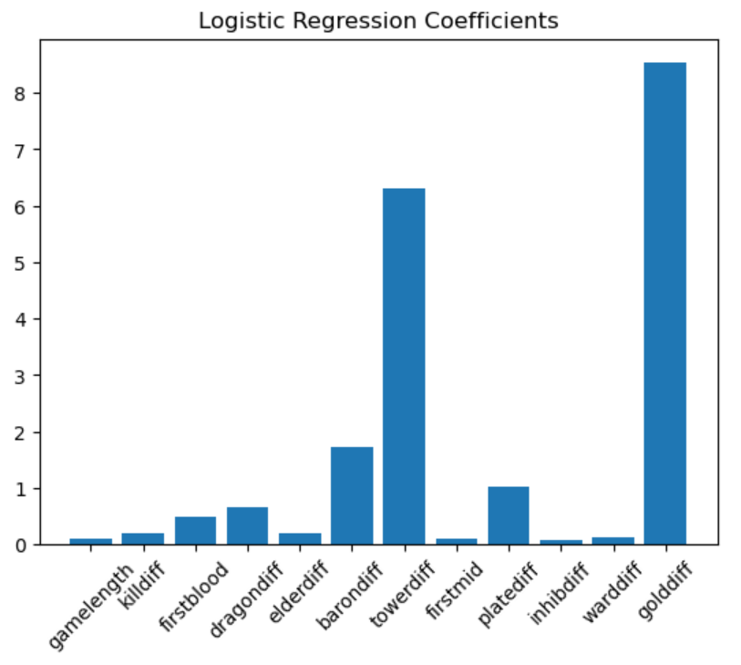
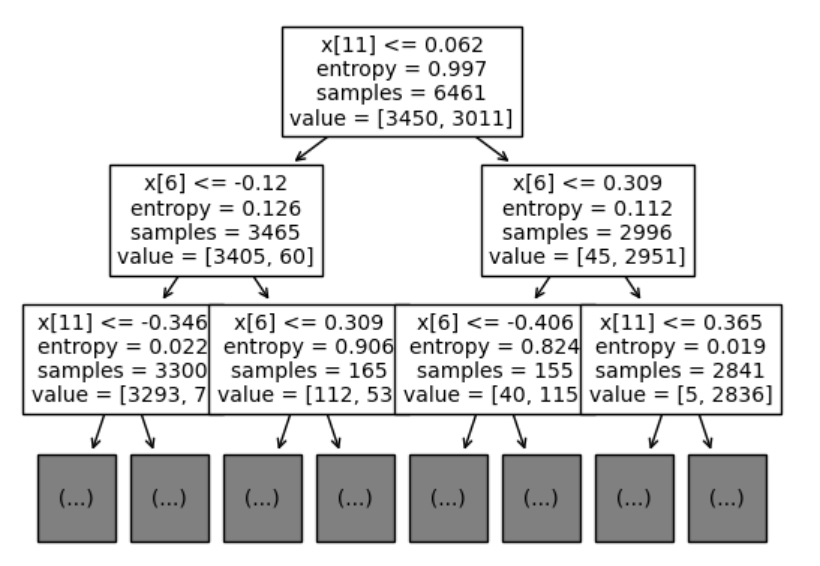
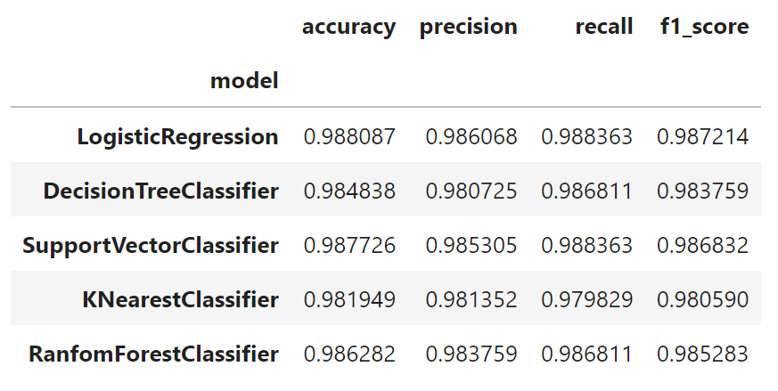

### Match Prediction

**Brady Menendez**

#### Executive summary
The goal of this project is to train models using previous League of Legends Match data to be able to predict the outcome of future games. These models will also be used to identify the biggest factors when it comes to determining who the winner will be.

#### Rationale
This model, and its ability to identify the most important factors when it comes to deciding the outcome of a match, can be very useful for both game developers and professional players. This can help identify undesired trends that can be fixed with balance changes, or detect what to focus on when it comes to minmaxing resources and coming up with new strategies. The winner prediction part of the model can be used to make better decisions when it comes to betting.

#### Research Question
Identify which features are the most relevant when it comes to predicting the outcome of the match.
Ability to predict the winner of a match based on mid-game live stats, or give a confidence percentage that reflects winning odds.

#### Data Sources
[Match DataLinks to an external site](https://oracleselixir.com/tools/downloads)

This link has downloads for multiple csv files containing match data of all major regions, organized by year. For this iteration of the project, only matches from 2023 will be used. 

#### Methodology
Classification models: Logistic Regression, KNN, SVM, Decision Trees
Cross Validation: GridSearchCV
Model Interpretability: Feature Importance, Coefficient Analysis
#### Results

After training a LogisticRegression model with the data, we can look at its coefficients:

We can see that gold differential and tower differential are the largest ones.

This image of the first levels of the DecisionTreeClassifier corroborate this:

Gold differential (x11) is used in the first split, while x6 (tower differential) is used in the second split.

Regarding metrics, all values are shown in this DataFrame:

#### Next steps
- Include all available matches from previous years.
- Input live match stats for a prediction on who is most likely to win.

#### Outline of project

- [First Draft](match_prediction.ipynb)

##### Contact and Further Information
E-Mail: bradymc1998@gmail.com
